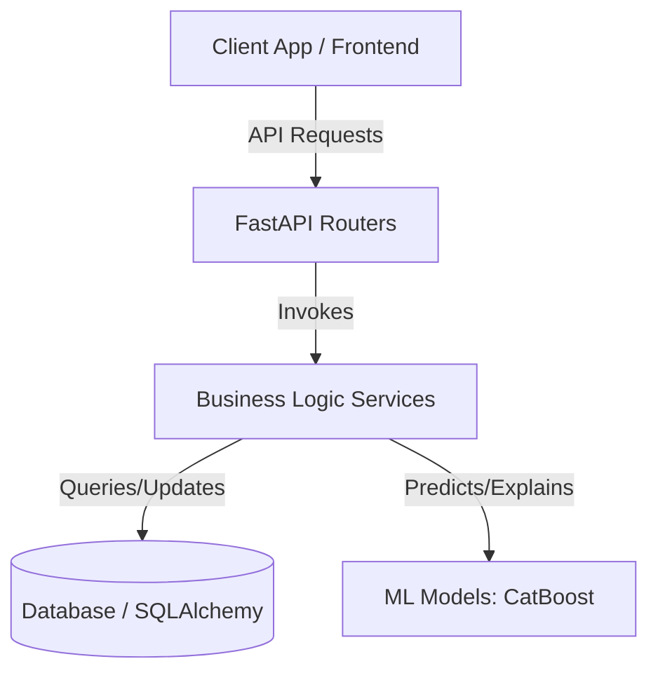

# Spark DeepStack Backend: Functions, Services, and Gap Analysis

This document provides a comprehensive mapping of all backend services, functions, database models, and API endpoints for the **Spark DeepStack** retail management platform. It also outlines the critical missing features in key modules (Inventory, Demand, Dashboard, and general systems) to serve as a roadmap for development.

---

## 1. Core Architecture Overview

The backend is built with **FastAPI** and **SQLAlchemy** (using PostgreSQL/SQLite). It integrates machine learning modules for credit risk evaluation and demand forecasting using **CatBoost**.

---

## 2. Services and Functions Directory

Below is the detailed list of backend services located in `app/services/` and their respective functions.

### 2.1. Authentication Service (`auth_service.py`)
Responsible for user account creation, credentials verification, and JWT session generation.
* **`register_user(db: Session, payload: UserRegisterRequest) -> User`**:
  * Registers a new store owner. Hashes the password and checks for duplicate emails.
* **`login_user(db: Session, payload: UserLoginRequest) -> LoginResponse`**:
  * Validates credentials, creates a JWT token, and returns user data with the token.
* **`get_user_profile(user: User) -> User`**:
  * Returns the authenticated user's profile details.

### 2.2. Shop Service (`shop_service.py`)
Manages store profiles owned by users.
* **`create_shop(db: Session, user: User, payload: ShopCreateRequest) -> Shop`**:
  * Registers a new retail shop associated with the user.
* **`get_user_shops(db: Session, user: User) -> list[Shop]`**:
  * Lists all shops owned by the authenticated user.
* **`get_shop_by_id(db: Session, user: User, shop_id: uuid.UUID) -> Shop`**:
  * Fetches shop metadata by ID after verifying user ownership.
* **`update_shop(db: Session, user: User, shop_id: uuid.UUID, payload: ShopUpdateRequest) -> Shop`**:
  * Updates shop name, address, or location type.
* **`delete_shop(db: Session, user: User, shop_id: uuid.UUID) -> None`**:
  * Deletes a shop profile from the database.

### 2.3. Category Service (`category_service.py`)
Provides classification of products.
* **`create_category(db: Session, payload: CategoryCreateRequest) -> Category`**:
  * Adds a new category (e.g., Groceries, Snacks) and checks for duplicates.
* **`get_all_categories(db: Session) -> list[Category]`**:
  * Fetches all product categories.
* **`get_category_by_id(db: Session, category_id: uuid.UUID) -> Category`**:
  * Fetches a specific category by ID.
* **`update_category(db: Session, category_id: uuid.UUID, payload: CategoryUpdateRequest) -> Category`**:
  * Modifies category description or title.
* **`delete_category(db: Session, category_id: uuid.UUID) -> None`**:
  * Removes a category from the database.

### 2.4. Product & Inventory Service (`product_service.py`)
Handles catalog management and stock adjustments.
* **`_verify_shop_ownership(db: Session, user: User, shop_id: uuid.UUID) -> Shop`**:
  * Internal helper verifying the user owns the shop before performing product modifications.
* **`create_product(db: Session, user: User, shop_id: uuid.UUID, payload: ProductCreateRequest) -> Product`**:
  * Adds a new product to the shop's catalog. Checks for duplicate SKUs.
* **`get_products(db: Session, user: User, shop_id: uuid.UUID) -> list[Product]`**:
  * Retrieves all active products in the shop.
* **`get_product_by_id(db: Session, user: User, shop_id: uuid.UUID, product_id: uuid.UUID) -> Product`**:
  * Gets a single product by ID.
* **`update_product(db: Session, user: User, shop_id: uuid.UUID, product_id: uuid.UUID, payload: ProductUpdateRequest) -> Product`**:
  * Updates product info (selling price, cost, description, perishable flags, etc.).
* **`delete_product(db: Session, user: User, shop_id: uuid.UUID, product_id: uuid.UUID) -> None`**:
  * Performs a soft delete by setting `is_active = False`.
* **`stock_in(db: Session, user: User, shop_id: uuid.UUID, product_id: uuid.UUID, payload: StockAdjustRequest) -> Product`**:
  * Performs an inward inventory adjustment (adding stock).
* **`stock_out(db: Session, user: User, shop_id: uuid.UUID, product_id: uuid.UUID, payload: StockAdjustRequest) -> Product`**:
  * Performs an outward inventory adjustment (deducting stock). Verifies stock is sufficient.
* **`get_low_stock_products(db: Session, user: User, shop_id: uuid.UUID) -> list[Product]`**:
  * Returns active products whose `stock_quantity` is less than or equal to `reorder_level`.

### 2.5. Customer Service (`customer_service.py`)
Manages retail customers, particularly those operating on credit tabs (Khatas).
* **`create_customer(db: Session, user: User, shop_id: uuid.UUID, payload: CustomerCreateRequest) -> Customer`**:
  * Creates a customer profile and initializes credit limits.
* **`get_customers(db: Session, user: User, shop_id: uuid.UUID) -> list[Customer]`**:
  * Fetches all active customers registered in the shop.
* **`get_customer_by_id(db: Session, user: User, shop_id: uuid.UUID, customer_id: uuid.UUID) -> Customer`**:
  * Fetches customer details by ID.
* **`update_customer(db: Session, user: User, shop_id: uuid.UUID, customer_id: uuid.UUID, payload: CustomerUpdateRequest) -> Customer`**:
  * Modifies customer metadata (phone, credit limits).
* **`delete_customer(db: Session, user: User, shop_id: uuid.UUID, customer_id: uuid.UUID) -> None`**:
  * Soft deletes customer profile (`is_active = False`).

### 2.6. Transaction & Credit Sale Service (`transaction_service.py`)
Manages sales processing, stock auto-deductions, credit accounts, and payments.
* **`create_transaction(db: Session, user: User, shop_id: uuid.UUID, payload: TransactionCreateRequest) -> Transaction`**:
  * Places a sale. It aggregates items, checks stock levels, deducts inventory, calculates subtotals, and processes payment types (`cash`, `qr`, `credit`). If payment type is `credit`, it automatically:
    1. Creates a `CreditSale` database record.
    2. Adds the total amount to the customer's `current_outstanding_balance`.
    3. Updates `max_outstanding_ever` if the new balance is a historic high.
* **`get_transactions(db: Session, user: User, shop_id: uuid.UUID) -> list[Transaction]`**:
  * Lists all transactions in the shop in descending order of creation.
* **`get_transaction_by_id(db: Session, user: User, shop_id: uuid.UUID, transaction_id: uuid.UUID) -> Transaction`**:
  * Gets a single transaction including item details and credit sales logs.
* **`get_credit_sales(db: Session, user: User, shop_id: uuid.UUID, status_filter: CreditStatus | None = None) -> list[CreditSale]`**:
  * Lists all credit sales in a shop, optionally filtered by status (`paid`, `unpaid`, `overdue`).
* **`update_credit_sale(db: Session, user: User, shop_id: uuid.UUID, credit_sale_id: uuid.UUID, payload: CreditSaleUpdateRequest) -> CreditSale`**:
  * Updates a credit sale. If status is updated to `paid`, it logs payment time and automatically deducts the amount from the customer's `current_outstanding_balance`.

### 2.7. Dashboard Service (`dashboard_service.py`)
Computes KPIs and visualizations for the shop dashboard.
* **`get_dashboard(db: Session, user: User, shop_id: uuid.UUID) -> DashboardDetail`**:
  * Computes shop statistics:
    * **Summary Stats**: Total products, active customers, transaction count, revenue, COGS, total profit, outstanding credit, and today's stats.
    * **Revenue Breakdown**: Payment type split (Cash vs. QR vs. Credit).
    * **Top Products**: Top 5 best sellers by volume, revenue, and gross profit.
    * **Weekly Trend**: Daily sales and profit trend for the last 7 days.
    * **Category Analysis**: Product count, revenue, and profit per category.
    * **Inventory Status**: Counts of products in-stock, low-stock, and out-of-stock.

### 2.8. Credit Risk Service (`credit_risk_service.py`)
Connects the database features to the `CreditRiskPredictor` CatBoost model.
* **`_compute_features_from_db(db: Session, customer: Customer) -> Dict[str, Any]`**:
  * Extracts 18 numerical features from the customer's payment history: relationship length, purchase values, credit ratios, overdue history, days since last purchase, repayment consistency, etc.
* **`predict_direct(payload: CreditRiskPredictRequest) -> Dict[str, Any]`**:
  * Evaluates risk when features are supplied directly in the request.
* **`predict_probability_direct(payload: CreditRiskPredictRequest) -> Dict[str, Any]`**:
  * Returns calibrated probability directly.
* **`explain_direct(payload: CreditRiskPredictRequest, top_k: int = 5) -> Dict[str, Any]`**:
  * Uses SHAP values to explain a manually-defined prediction.
* **`predict_for_customer(db: Session, shop_id: uuid.UUID, customer_id: uuid.UUID, save_result: bool = True) -> Dict[str, Any]`**:
  * Derives features from the DB, predicts risk for a customer, suggests an updated credit limit, and commits results to the `credit_predictions` database table.
* **`explain_for_customer(db: Session, shop_id: uuid.UUID, customer_id: uuid.UUID, top_k: int = 5) -> Dict[str, Any]`**:
  * Auto-computes customer features and generates SHAP drivers.
* **`get_global_feature_importance() -> Dict[str, Any]`**:
  * Fetches global feature importance from the credit risk ML model.
* **`get_model_metadata() -> Dict[str, Any]`**:
  * Exposes model version, performance metrics, and decision thresholds.

### 2.9. Demand Forecast Service (`demand_forecast_service.py`)
Executes recursive predictions using the `DemandForecaster` CatBoost model.
* **`forecast_next_day(payload: DemandForecastRequest) -> Dict[str, Any]`**:
  * Predicts unit demand for the next day using input features.
* **`forecast_next_7_days(payload: DemandForecastRequest) -> List[Dict[str, Any]]`**:
  * Predicts unit demand recursively for the next 7 days.
* **`explain_next_day(payload: DemandForecastRequest) -> Dict[str, Any]`**:
  * Evaluates next-day demand with SHAP explanation.
* **`explain_next_7_days(payload: DemandForecastRequest) -> List[Dict[str, Any]]`**:
  * Explains 7-day recursive predictions with SHAP.
* **`forecast_next_day_for_product(db: Session, shop_id: uuid.UUID, payload: DemandForecastByProductRequest) -> Dict[str, Any]`**:
  * Predicts next-day demand for a product after fetching product flags and shop location type from the DB.
* **`forecast_next_7_days_for_product(db: Session, shop_id: uuid.UUID, payload: DemandForecastByProductRequest) -> List[Dict[str, Any]]`**:
  * Predicts 7-day demand for a product after pulling metadata from the DB.
* **`get_global_feature_importance() -> Dict[str, Any]`**:
  * Returns feature importance metrics for the demand forecaster.
* **`get_model_metadata() -> Dict[str, Any]`**:
  * Exposes training evaluation metrics (R², RMSE, MAE).
* **`_build_product_sales_history(db: Session, shop_id: uuid.UUID, product_id: uuid.UUID, last_date_str: str, num_days: int) -> tuple[List[float], List[int], str]`**:
  * **[Unused Helper]** Groups transactions by date to generate sales and transaction history arrays.

---

## 3. API Endpoints & Service Mapping

| Module | HTTP Method | Endpoint Path | Core Service Invoked |
| :--- | :--- | :--- | :--- |
| **Auth** | `POST` | `/api/v1/auth/register` | `auth_service.register_user` |
| | `POST` | `/api/v1/auth/login` | `auth_service.login_user` |
| | `GET` | `/api/v1/auth/me` | `auth_service.get_user_profile` |
| | `POST` | `/api/v1/auth/logout` | None (Client-side token discard) |
| **Shops** | `POST` | `/api/v1/shops/` | `shop_service.create_shop` |
| | `GET` | `/api/v1/shops/` | `shop_service.get_user_shops` |
| | `GET` | `/api/v1/shops/{shop_id}` | `shop_service.get_shop_by_id` |
| | `PATCH` | `/api/v1/shops/{shop_id}` | `shop_service.update_shop` |
| | `DELETE` | `/api/v1/shops/{shop_id}` | `shop_service.delete_shop` |
| **Categories**| `POST` | `/api/v1/categories/` | `category_service.create_category` |
| | `GET` | `/api/v1/categories/` | `category_service.get_all_categories` |
| | `GET` | `/api/v1/categories/{category_id}`| `category_service.get_category_by_id` |
| | `PATCH` | `/api/v1/categories/{category_id}`| `category_service.update_category` |
| | `DELETE` | `/api/v1/categories/{category_id}`| `category_service.delete_category` |
| **Products** | `POST` | `/api/v1/shops/{shop_id}/products/` | `product_service.create_product` |
| | `GET` | `/api/v1/shops/{shop_id}/products/` | `product_service.get_products` |
| | `GET` | `/api/v1/shops/{shop_id}/products/low-stock` | `product_service.get_low_stock_products` |
| | `GET` | `/api/v1/shops/{shop_id}/products/{product_id}` | `product_service.get_product_by_id` |
| | `PATCH` | `/api/v1/shops/{shop_id}/products/{product_id}` | `product_service.update_product` |
| | `DELETE` | `/api/v1/shops/{shop_id}/products/{product_id}` | `product_service.delete_product` (soft delete) |
| | `POST` | `/api/v1/shops/{shop_id}/products/{product_id}/stock-in` | `product_service.stock_in` |
| | `POST` | `/api/v1/shops/{shop_id}/products/{product_id}/stock-out` | `product_service.stock_out` |
| **Customers** | `POST` | `/api/v1/shops/{shop_id}/customers/` | `customer_service.create_customer` |
| | `GET` | `/api/v1/shops/{shop_id}/customers/` | `customer_service.get_customers` |
| | `GET` | `/api/v1/shops/{shop_id}/customers/{customer_id}` | `customer_service.get_customer_by_id` |
| | `PATCH` | `/api/v1/shops/{shop_id}/customers/{customer_id}` | `customer_service.update_customer` |
| | `DELETE` | `/api/v1/shops/{shop_id}/customers/{customer_id}` | `customer_service.delete_customer` (soft delete) |
| **Tx / Credit**| `POST` | `/api/v1/shops/{shop_id}/transactions/` | `transaction_service.create_transaction` |
| | `GET` | `/api/v1/shops/{shop_id}/transactions/` | `transaction_service.get_transactions` |
| | `GET` | `/api/v1/shops/{shop_id}/transactions/{transaction_id}` | `transaction_service.get_transaction_by_id` |
| | `GET` | `/api/v1/shops/{shop_id}/transactions/credit-sales/` | `transaction_service.get_credit_sales` |
| | `PATCH` | `/api/v1/shops/{shop_id}/transactions/credit-sales/{credit_sale_id}` | `transaction_service.update_credit_sale` |
| **Dashboard** | `GET` | `/api/v1/shops/{shop_id}/dashboard/` | `dashboard_service.get_dashboard` |
| **ML – Credit**| `POST` | `/api/v1/ml/credit-risk/predict` | `credit_risk_service.predict_direct` |
| | `POST` | `/api/v1/ml/credit-risk/predict-probability` | `credit_risk_service.predict_probability_direct` |
| | `POST` | `/api/v1/ml/credit-risk/explain` | `credit_risk_service.explain_direct` |
| | `GET` | `/api/v1/ml/credit-risk/global-importance` | `credit_risk_service.get_global_feature_importance` |
| | `GET` | `/api/v1/ml/credit-risk/model-info` | `credit_risk_service.get_model_metadata` |
| | `POST` | `/api/v1/shops/{shop_id}/customers/{customer_id}/credit-risk/predict` | `credit_risk_service.predict_for_customer` |
| | `POST` | `/api/v1/shops/{shop_id}/customers/{customer_id}/credit-risk/explain` | `credit_risk_service.explain_for_customer` |
| **ML – Demand**| `POST` | `/api/v1/ml/demand/predict-next-day` | `demand_forecast_service.forecast_next_day` |
| | `POST` | `/api/v1/ml/demand/predict-next-7-days` | `demand_forecast_service.forecast_next_7_days` |
| | `POST` | `/api/v1/ml/demand/explain-next-day` | `demand_forecast_service.explain_next_day` |
| | `POST` | `/api/v1/ml/demand/explain-next-7-days` | `demand_forecast_service.explain_next_7_days` |
| | `GET` | `/api/v1/ml/demand/global-importance` | `demand_forecast_service.get_global_feature_importance` |
| | `GET` | `/api/v1/ml/demand/model-info` | `demand_forecast_service.get_model_metadata` |
| | `POST` | `/api/v1/shops/{shop_id}/demand/products/{product_id}/predict-next-day` | `demand_forecast_service.forecast_next_day_for_product` |
| | `POST` | `/api/v1/shops/{shop_id}/demand/products/{product_id}/predict-next-7-days` | `demand_forecast_service.forecast_next_7_days_for_product` |

---

## 4. Comprehensive Missing Feature Analysis

The current backend is a solid prototype, but several critical gaps exist in the key modules that are standard in mature retail management and analytics software.

### 4.1. Inventory Gaps
* **Missing Audit Trail (Inventory Log/Ledger)**:
  * *Current State*: The `stock_in` and `stock_out` functions alter the `stock_quantity` field directly on the `products` table.
  * *Gap*: There is no record table (e.g., `InventoryLedger`) logging *who* performed the adjustment, *when* it occurred, *what* the quantity delta was, and the *reason* for it. It makes stock audits impossible.
* **Lack of Supplier/Wholesaler Management**:
  * *Current State*: No database models exist for suppliers.
  * *Gap*: Stores restock from wholesalers. The system needs a `Supplier` model (name, contact, outstanding balance to supplier) and a way to log supply shipments.
* **No Purchase Orders (PO)**:
  * *Current State*: Restocking is done manually without document workflows.
  * *Gap*: Lack of support for creating, tracking, and completing Purchase Orders to order items from wholesalers.
* **Perishable Expiration and Batch Tracking**:
  * *Current State*: Products have a boolean `is_perishable` flag, but nothing else.
  * *Gap*: No support for product batch numbers, manufacturing dates, or expiration dates. Store owners cannot track expiring items.
* **Missing Inventory Asset Valuation**:
  * *Current State*: Not calculated or served on endpoints.
  * *Gap*: The API lacks endpoints to calculate the total current value of inventory asset holding costs (`sum(stock_quantity * cost_price)`) and potential sales value (`sum(stock_quantity * selling_price)`).
* **No Bulk Import/Export**:
  * *Current State*: Products can only be created one-by-one.
  * *Gap*: Store owners with hundreds of products need CSV/Excel import and export endpoints.

### 4.2. Demand Forecasting Gaps
* **Unused Database-Derived History Aggregator**:
  * *Current State*: The service implements `_build_product_sales_history` to pull historical sales from transactions. However, the product endpoints (`/shops/{shop_id}/demand/products/{product_id}/predict-next-day`) do not use this helper.
  * *Gap*: The endpoints still expect the client frontend to pass the arrays `sales_history` and `transactions_history`. They should be automatically compiled on the fly using DB transactions.
* **No Forecast Persistence and Accuracy Metrics Tracking**:
  * *Current State*: Predictions are returned to the client but never saved.
  * *Gap*: The database has a `demand_forecasts` table, but the service never inserts data into it. The system should write predicted quantities to `demand_forecasts` and periodically cross-reference actual sales to measure error metrics (RMSE/MAE/R²) dynamically in the DB.
* **Missing Model Retraining Triggers**:
  * *Current State*: The ML models are pickled singletons loaded on startup.
  * *Gap*: No API endpoints exist to trigger retraining of the demand model on newly accumulated transaction data.
* **No Shop-Wide/Bulk Forecasting**:
  * *Current State*: Forecasts can only be requested for one product at a time.
  * *Gap*: Store owners need a single endpoint that generates restock/demand suggestions for all low-stock products in the shop simultaneously.
* **Out-of-Stock Suppression Correction**:
  * *Current State*: If a product is out of stock, its sales history lists `0.0`. The ML model interprets this as zero demand.
  * *Gap*: True demand is non-zero, but restricted by stockouts. The model needs logic to identify and adjust historical sales for stockout periods during feature extraction.

### 4.3. Dashboard Gaps
* **No Custom Date Range Filtering**:
  * *Current State*: Dashboard metrics are hardcoded (Today's statistics, 7-day trends, and all-time summaries).
  * *Gap*: The `get_dashboard` function does not accept query parameters for date ranges (`start_date` and `end_date`), making it impossible to check performance for last month, last quarter, or custom periods.
* **Absence of Credit Risk Metrics Summary**:
  * *Current State*: Only `total_credit_outstanding` is pulled.
  * *Gap*: Store owners need credit health KPIs: average customer risk level, count of high-risk customer tabs, overdue amount vs. pending amount, and aging credit tabs (30, 60, 90+ days late).
* **Missing Demand Forecasting Integration**:
  * *Current State*: Dashboard and demand forecasting are disconnected.
  * *Gap*: The dashboard should display a "Predicted Stockouts" widget highlighting products expected to run out in the next 7 days based on ML demand predictions.
* **No Comparative Growth Rates**:
  * *Current State*: Only absolute values are returned.
  * *Gap*: Store owners want comparison figures, such as week-over-week (WoW) or month-over-month (MoM) revenue/profit percentage growth.
* **No Customer Retention/Churn Metrics**:
  * *Current State*: Lists `total_customers`.
  * *Gap*: Missing analytics for customer lifetime value (LTV), active vs. dormant customers, and average purchase frequency.

### 4.4. General System Gaps
* **Unused AI Agent Settings**:
  * *Current State*: Core settings (`app/core/config.py`) contain configuration options for `GEMINI_API_KEY`, `GROQ_API_KEY`, and `ELEVEN_LABS_API_KEY`.
  * *Gap*: No routers, services, or models are implemented in the API to power generative AI, voice-enabled order entries, or natural language querying.
* **Lack of Multi-Role Permissions (Role-Based Access Control)**:
  * *Current State*: Simple JWT authentication via user profiles.
  * *Gap*: Store owners often have cashiers or inventory managers. The system needs Roles (Owner, Cashier, Manager) with restricted access policies.
* **No Actual Payment Gateway Integration**:
  * *Current State*: Payment types `qr` and `cash` are processed identically as metadata records.
  * *Gap*: No backend hooks for verifying payments or generating dynamic QR codes from merchant payment APIs (e.g., Fonepay, Khalti, eSewa).
* **No Notification/Alerting System**:
  * *Current State*: Low-stock flags are computed on-request.
  * *Gap*: A background worker system is needed to send email, SMS, or WhatsApp alerts to owners for imminent stockouts or overdue credit tabs.
